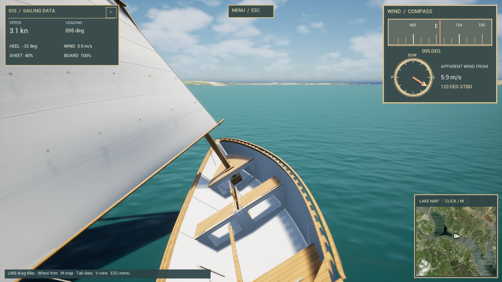

# Goat Island Skiff Sim

A playable Goat Island Skiff sailing game for **Unreal Engine 5.8.3**, with an editable Blender boat, a browser prototype, and a Lake Greenwood, South Carolina map built from public GIS data. The Unreal project models sail trim, apparent wind, heeling, yaw, crew weight, tacks, jibes, getting stuck in irons, and capsizing. The boat has a balanced lug sail, square hollow mast, sliding centerboard, and sliding rudder blade.

## Play and develop

| Part | Where to start |
| --- | --- |
| Unreal game | Open [`gis_game/unreal/GISGame.uproject`](gis_game/unreal/GISGame.uproject) in Unreal Engine 5.8.3. The project needs a Visual Studio 2022 C++ toolchain and Windows SDK; allow Unreal to build the C++ module, then play the `GISLake` map. See the [Unreal setup and controls](gis_game/unreal/README.md). Keep `gis_game/unreal` beside `gis_game/sim_core`, which supplies the sailing simulation. |
| Editable boat | Open [`game_asset/Goat_Island_Skiff_Game.blend`](game_asset/Goat_Island_Skiff_Game.blend) in Blender. The FBX mesh and six animation clips are in [`game_asset/`](game_asset/), with [rig and import details](game_asset/README_Unreal.md). The playable Unreal project already contains imported boat assets. |
| Browser prototype | Open [`gis_game/web/index.html`](gis_game/web/index.html) in a desktop browser, or follow the [local server instructions](gis_game/web/README.md). This is a separate Canvas prototype with simpler artwork and physics. |

The Unreal game starts with a close third-person camera; **V** toggles first person. Hold the left mouse button and drag to move the tiller in the same direction as your hand; the bow turns the opposite way while moving ahead. Scroll to trim or ease the mainsheet. **M** opens the lake map, **Tab** collapses the data card, and **Esc** opens Resume, Settings, and Quit to Desktop. The [complete Unreal control list](gis_game/unreal/README.md#sail-and-look-around) covers crew position, centerboard, rudder blade, sail hoist, camera, and capsize recovery.

## Lake Greenwood data

The default water outline comes from the **USGS National Hydrography Dataset**. Land elevations come from **USGS 3DEP**, and the aerial terrain texture comes from **USGS/USDA NAIP**. Located bridges, rail crossings, dam components, and public access points use SCDOT, SCDNR, USACE, and USGS records; their in-game shapes and heights are approximations. The [map overview](gis_game/maps/README.md), [terrain notes](gis_game/maps/terrain/README.md), [imagery attribution](gis_game/maps/imagery/README.md), and [landmark sources](gis_game/maps/landmarks/README.md) document the source links, processing, and limits.

Raw response caches from state GIS services are omitted from this repository. The landmark rebuild script can fetch current source responses with `--refresh`.

**For game use only — not for navigation.** The map does not provide verified depths, hazards, current water levels, bridge clearances, or live wind. Sailing coefficients are game tuning, not measurements of a real skiff. Other lake outlines can be loaded in the browser prototype; the [Unreal map notes](gis_game/unreal/README.md#lake-data-and-adding-maps) explain how to supply another shoreline, while Greenwood-specific terrain and scenery need corresponding new data.

## Project layout

- [`gis_game/unreal/`](gis_game/unreal/) — Unreal source project and imported game assets.
- [`gis_game/sim_core/`](gis_game/sim_core/) — portable C++ sailing solver and tests.
- [`gis_game/maps/`](gis_game/maps/) — processed GIS data, conversion scripts, metadata, and tests.
- [`gis_game/web/`](gis_game/web/) — playable browser prototype and tests.
- [`game_asset/`](game_asset/) — editable Blender scene, source exports, rig documentation, and previews.

Build and test commands are documented in the [Unreal](gis_game/unreal/README.md#accuracy-and-current-limits), [simulation](gis_game/sim_core/README.md), [browser](gis_game/web/README.md), and [map](gis_game/maps/README.md) notes. Unreal Engine and Blender are installed separately; generated build caches and packaged Windows executables are not part of the source project.
